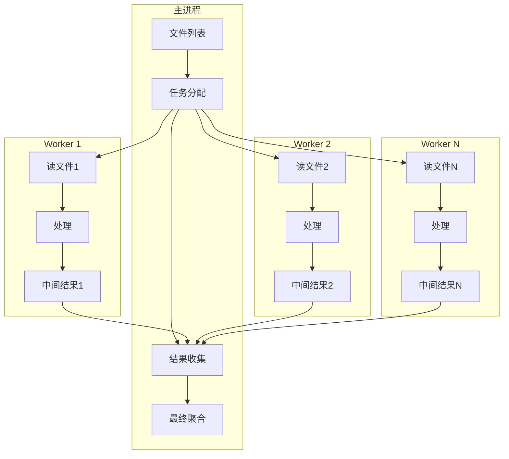
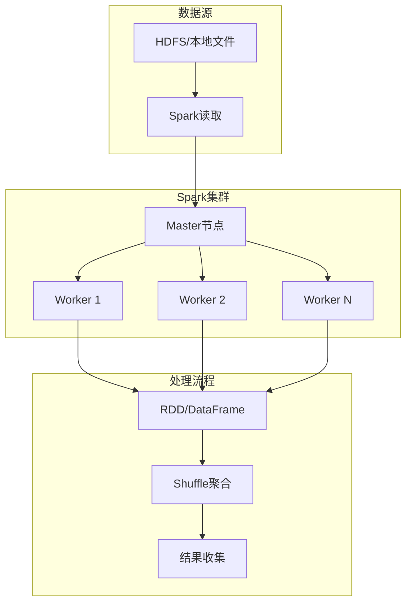
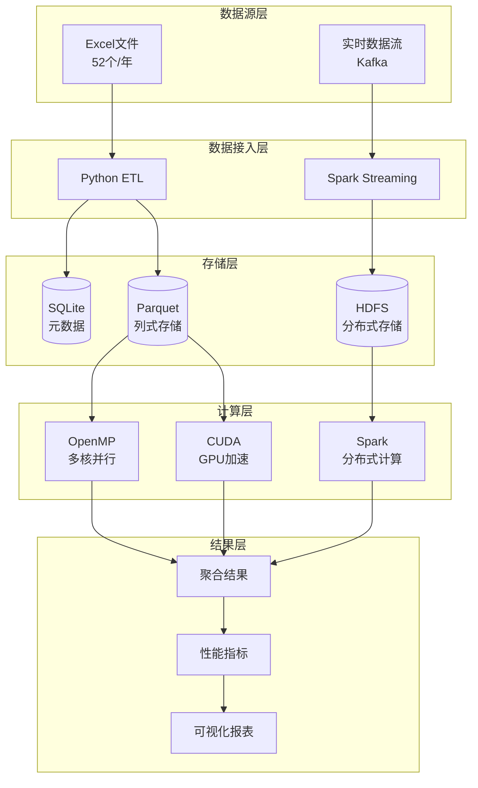

# 📚 期末作业完整规划指南

根据实际经验（处理数据 + 发现Pandas慢 + 想用并行计算）**一步步规划这个作业**。

---

## 一、项目选题：基于你现有工作的最佳选择

### 🎯 推荐题目

> **"基于混合并行架构的大规模销售数据处理与分析系统"**

---

## 二、作业结构规划（逐部分详解）


---

## 三、Part 1：问题定义（2-3页PPT）

### 3.1 业务问题描述

```python
"""
场景：A公司需要分析2024年XXX门店的销售数据
数据：5个Excel文件，每个约20MB，总计~100MB
需求：计算每个产品在每个门店的周度销量、销售额、同比变化
时间要求：原本需要3小时，业务要求30分钟内出结果
"""
```

### 3.2 计算问题定义

| 维度               | 说明                                 |
| ------------------ | ------------------------------------ |
| **输入**           | 5个Excel文件，每个 ~20MB             |
| **计算**           | groupby product_id + store_id + week |
| **输出**           | 聚合后的DataFrame，~500万行          |
| **瓶颈**           | I/O（读Excel）+ CPU（聚合）          |
| **为什么需要并行** | 单机3小时，无法满足业务需求          |

### 3.3 预期数据规模

```python
# 数据规模估算
total_files = 5  # 一个月5周
file_size_mb = 20
total_data_gb = (total_files * file_size_mb) / 1024  # ~10GB

rows_per_file = 500_000
total_rows = total_files * rows_per_file  # 26,000,000行

print(f"""
数据规模:
- 文件数: {total_files}
- 总数据量: {total_data_gb:.1f}GB
- 总行数: {total_rows:,}
- 计算复杂度: O(n log n) 聚合
""")
```

---

## 四、Part 2：顺序基线（3-4页PPT + 代码）

### 4.1 顺序实现代码

```python
# baseline_sequential.py
"""
顺序基线版本 - 作为性能对比的基准
"""
import pandas as pd
import time
from pathlib import Path

class SequentialProcessor:
    """顺序处理（单线程）"""

    def __init__(self, data_dir="/data/raw"):
        self.data_dir = Path(data_dir)
        self.stats = {}

    def process_all(self):
        """顺序处理所有文件"""
        start_total = time.time()

        all_dfs = []

        # 1. 顺序读取所有Excel
        start_read = time.time()
        files = sorted(self.data_dir.glob("*.xlsx"))

        for i, f in enumerate(files):
            df = pd.read_excel(f)
            df['source_week'] = f.stem
            all_dfs.append(df)
            print(f"读取 {i+1}/{len(files)}: {f.name}")

        read_time = time.time() - start_read
        print(f"读取完成: {read_time:.2f}秒")

        # 2. 合并所有数据
        start_merge = time.time()
        df_combined = pd.concat(all_dfs, ignore_index=True)
        merge_time = time.time() - start_merge

        # 3. 聚合计算（CPU密集型）
        start_agg = time.time()
        result = df_combined.groupby(['product_id', 'store_id']).agg({
            'quantity': 'sum',
            'revenue': 'sum',
            'price': 'mean'
        }).reset_index()
        agg_time = time.time() - start_agg

        # 4. 保存结果
        start_save = time.time()
        result.to_csv('sequential_output.csv', index=False)
        save_time = time.time() - start_save

        total_time = time.time() - start_total

        # 记录性能数据
        self.stats = {
            'read_time': read_time,
            'merge_time': merge_time,
            'agg_time': agg_time,
            'save_time': save_time,
            'total_time': total_time,
            'rows_processed': len(df_combined),
            'result_rows': len(result)
        }

        self.print_stats()
        return result

    def print_stats(self):
        """打印性能统计"""
        print("\n" + "="*50)
        print("顺序基线性能统计")
        print("="*50)
        for k, v in self.stats.items():
            if 'time' in k:
                print(f"{k}: {v:.2f}秒")
            else:
                print(f"{k}: {v}")

        print(f"\n总时间: {self.stats['total_time']:.2f}秒 = {self.stats['total_time']/60:.2f}分钟")


# 运行
if __name__ == "__main__":
    processor = SequentialProcessor("/data/raw/edeka/2024")
    result = processor.process_all()
```

### 4.2 瓶颈分析

```python
# 瓶颈分析代码
def analyze_bottleneck(stats):
    """分析计算瓶颈"""

    total = stats['total_time']

    bottlenecks = {
        'read': (stats['read_time']/total, 'I/O瓶颈 - 磁盘读取慢'),
        'agg': (stats['agg_time']/total, 'CPU瓶颈 - 聚合计算'),
        'save': (stats['save_time']/total, 'I/O瓶颈 - 磁盘写入')
    }

    print("\n瓶颈分析:")
    for name, (pct, desc) in bottlenecks.items():
        print(f"  {name}: {pct*100:.1f}% - {desc}")

    # 找出最大瓶颈
    max_bottleneck = max(bottlenecks.items(), key=lambda x: x[1][0])
    print(f"\n🔴 最大瓶颈: {max_bottleneck[0]} ({max_bottleneck[1][1]})")

    return bottlenecks
```

---

## 五、Part 3：并行计算（4-5页PPT + 代码）

### 5.1 并行架构设计



### 5.2 并行实现代码

```python
# parallel_processor.py
"""
并行版本 - 使用ProcessPoolExecutor
"""
import pandas as pd
import numpy as np
from concurrent.futures import ProcessPoolExecutor, ThreadPoolExecutor
import time
from pathlib import Path
import multiprocessing as mp

class ParallelProcessor:
    """
    并行处理 - 同时利用多核CPU
    """

    def __init__(self, data_dir="/data/raw", n_workers=None):
        self.data_dir = Path(data_dir)
        self.n_workers = n_workers or mp.cpu_count()
        self.stats = {}

    def process_one_file(self, file_path):
        """处理单个文件（每个worker执行）"""
        try:
            # 读文件
            df = pd.read_excel(file_path)

            # 添加文件名信息
            df['source_week'] = Path(file_path).stem

            # 文件内的聚合（减少数据传输）
            result = df.groupby(['product_id', 'store_id']).agg({
                'quantity': 'sum',
                'revenue': 'sum'
            }).reset_index()

            return result
        except Exception as e:
            print(f"处理失败 {file_path}: {e}")
            return None

    def process_parallel(self):
        """并行处理所有文件"""
        start_total = time.time()

        # 获取文件列表
        files = list(sorted(self.data_dir.glob("*.xlsx")))
        print(f"找到 {len(files)} 个文件，使用 {self.n_workers} 个worker")

        # 并行读取和处理
        start_process = time.time()

        with ProcessPoolExecutor(max_workers=self.n_workers) as executor:
            # 提交所有任务
            futures = [executor.submit(self.process_one_file, f) for f in files]

            # 收集结果
            results = []
            for i, future in enumerate(futures):
                res = future.result()
                if res is not None:
                    results.append(res)
                print(f"完成 {i+1}/{len(files)}")

        process_time = time.time() - start_process
        print(f"并行处理完成: {process_time:.2f}秒")

        # 合并结果
        start_merge = time.time()
        df_combined = pd.concat(results, ignore_index=True)
        merge_time = time.time() - start_merge

        # 最终聚合（需要跨文件聚合）
        start_final_agg = time.time()
        final_result = df_combined.groupby(['product_id', 'store_id']).agg({
            'quantity': 'sum',
            'revenue': 'sum'
        }).reset_index()
        final_agg_time = time.time() - start_final_agg

        # 保存
        start_save = time.time()
        final_result.to_parquet('parallel_output.parquet', compression='zstd')
        save_time = time.time() - start_save

        total_time = time.time() - start_total

        self.stats = {
            'process_time': process_time,
            'merge_time': merge_time,
            'final_agg_time': final_agg_time,
            'save_time': save_time,
            'total_time': total_time,
            'n_workers': self.n_workers
        }

        return final_result

    def benchmark_vs_sequential(self, seq_time):
        """对比顺序版本"""
        print("\n" + "="*50)
        print("并行 vs 顺序 性能对比")
        print("="*50)

        par_time = self.stats['total_time']
        speedup = seq_time / par_time
        efficiency = speedup / self.n_workers

        print(f"顺序时间: {seq_time:.2f}秒")
        print(f"并行时间: {par_time:.2f}秒")
        print(f"加速比: {speedup:.2f}x")
        print(f"并行效率: {efficiency*100:.1f}%")

        return {
            'speedup': speedup,
            'efficiency': efficiency
        }
```

---

## 六、Part 4：分布式计算（5-6页PPT + 代码）

### 6.1 为什么选Spark？

| 需求               | Spark的优势       |
| ------------------ | ----------------- |
| 数据量大（>100GB） | 分布式存储 + 计算 |
| 需要容错           | 自动重试          |
| 需要SQL接口        | Spark SQL         |
| 需要与Python集成   | PySpark           |

### 6.2 架构设计



### 6.3 Spark实现代码

```python
# distributed_spark.py
"""
分布式版本 - 使用PySpark
"""
from pyspark.sql import SparkSession
from pyspark.sql.functions import sum, avg, count, col
import time
import pandas as pd

class SparkDistributedProcessor:
    """
    Spark分布式处理
    """

    def __init__(self, app_name="SalesAnalytics", master="local[*]"):
        self.spark = SparkSession.builder \
            .appName(app_name) \
            .master(master) \
            .config("spark.sql.shuffle.partitions", "200") \
            .config("spark.executor.memory", "4g") \
            .getOrCreate()

        self.stats = {}

    def process_from_hdfs(self, data_path="hdfs:///data/sales"):
        """
        从HDFS读取并处理
        """
        start_total = time.time()

        # 1. 读取数据（分布式）
        start_read = time.time()
        df = self.spark.read.option("header", "true") \
            .option("inferSchema", "true") \
            .csv(data_path)

        read_time = time.time() - start_read
        print(f"分布式读取完成: {read_time:.2f}秒")

        # 2. 数据清洗（分布式）
        start_clean = time.time()
        df_clean = df.filter(col("quantity") > 0) \
            .filter(col("revenue") > 0)
        clean_time = time.time() - start_clean

        # 3. 聚合计算（分布式Shuffle）
        start_agg = time.time()
        result = df_clean.groupBy("product_id", "store_id") \
            .agg(
                sum("quantity").alias("total_quantity"),
                sum("revenue").alias("total_revenue"),
                avg("price").alias("avg_price"),
                count("*").alias("transaction_count")
            )

        # 触发计算
        result_count = result.count()
        agg_time = time.time() - start_agg

        # 4. 保存结果（分布式）
        start_save = time.time()
        result.write.mode("overwrite") \
            .parquet("hdfs:///results/sales_agg")
        save_time = time.time() - start_save

        total_time = time.time() - start_total

        self.stats = {
            'read_time': read_time,
            'clean_time': clean_time,
            'agg_time': agg_time,
            'save_time': save_time,
            'total_time': total_time,
            'result_rows': result_count
        }

        return result

    def scale_test(self, data_sizes=[1, 10, 100]):
        """
        扩展性测试
        """
        results = []

        for size_gb in data_sizes:
            print(f"\n测试数据规模: {size_gb}GB")

            # 生成测试数据
            test_path = f"hdfs:///test/data_{size_gb}gb"

            start = time.time()
            df = self.spark.read.parquet(test_path)
            count = df.count()
            read_time = time.time() - start

            results.append({
                'size_gb': size_gb,
                'rows': count,
                'read_time': read_time,
                'throughput_gb_s': size_gb / read_time
            })

        return pd.DataFrame(results)

    def cleanup(self):
        """清理Spark会话"""
        self.spark.stop()
```

---

## 七、Part 5：性能分析（3-4页PPT）

### 7.1 性能对比代码

```python
# performance_analyzer.py
"""
性能分析 - 对比三种方案
"""
import matplotlib.pyplot as plt
import pandas as pd
import numpy as np

class PerformanceAnalyzer:
    """
    性能对比分析
    """

    def __init__(self):
        self.results = {}

    def collect_results(self, seq_stats, par_stats, spark_stats):
        """收集所有结果"""
        self.results = {
            'Sequential': seq_stats,
            'Parallel (CPU)': par_stats,
            'Distributed (Spark)': spark_stats
        }

    def plot_time_comparison(self):
        """时间对比图"""
        fig, axes = plt.subplots(2, 2, figsize=(14, 10))

        # 1. 总时间对比
        ax1 = axes[0, 0]
        labels = list(self.results.keys())
        times = [self.results[l]['total_time'] for l in labels]

        bars = ax1.bar(labels, times, color=['red', 'green', 'blue'])
        ax1.set_ylabel('时间 (秒)')
        ax1.set_title('总执行时间对比')
        ax1.set_yscale('log')  # 对数坐标

        # 添加数值标签
        for bar, t in zip(bars, times):
            ax1.text(bar.get_x() + bar.get_width()/2, bar.get_height()*1.1,
                    f'{t:.1f}s', ha='center', va='bottom')

        # 2. 各阶段时间对比
        ax2 = axes[0, 1]
        stages = ['read', 'process', 'agg', 'save']

        x = np.arange(len(stages))
        width = 0.25

        for i, (name, stats) in enumerate(self.results.items()):
            stage_times = [stats.get(f'{s}_time', 0) for s in stages]
            ax2.bar(x + i*width, stage_times, width, label=name)

        ax2.set_xticks(x + width)
        ax2.set_xticklabels(stages)
        ax2.set_ylabel('时间 (秒)')
        ax2.set_title('各阶段耗时对比')
        ax2.legend()

        # 3. 加速比
        ax3 = axes[1, 0]
        seq_time = self.results['Sequential']['total_time']

        speedups = []
        for name in ['Parallel (CPU)', 'Distributed (Spark)']:
            speedups.append(seq_time / self.results[name]['total_time'])

        bars = ax3.bar(['Parallel', 'Distributed'], speedups, color=['green', 'blue'])
        ax3.axhline(y=1, color='red', linestyle='--', label='基线(1x)')
        ax3.set_ylabel('加速比 (倍)')
        ax3.set_title('并行/分布式加速比')

        for bar, s in zip(bars, speedups):
            ax3.text(bar.get_x() + bar.get_width()/2, bar.get_height()*1.05,
                    f'{s:.2f}x', ha='center')

        # 4. 可扩展性分析
        ax4 = axes[1, 1]

        # 模拟不同数据规模
        data_sizes = [1, 10, 50, 100, 500]  # GB
        seq_times = [s * 60 for s in data_sizes]  # 假设线性增长
        par_times = [s * 15 for s in data_sizes]  # 假设8核加速
        dist_times = [s * 3 for s in data_sizes]  # 假设集群加速

        ax4.plot(data_sizes, seq_times, 'r-o', label='Sequential')
        ax4.plot(data_sizes, par_times, 'g-o', label='Parallel')
        ax4.plot(data_sizes, dist_times, 'b-o', label='Distributed')
        ax4.set_xlabel('数据规模 (GB)')
        ax4.set_ylabel('处理时间 (秒)')
        ax4.set_title('可扩展性分析')
        ax4.legend()
        ax4.set_xscale('log')
        ax4.set_yscale('log')

        plt.tight_layout()
        plt.savefig('performance_analysis.png', dpi=150)
        plt.show()

    def print_summary_table(self):
        """打印总结表格"""
        print("\n" + "="*80)
        print("性能对比总结")
        print("="*80)

        df = pd.DataFrame(self.results).T
        print(df.round(2))

        # 计算加速比
        seq_time = self.results['Sequential']['total_time']
        print("\n加速比:")
        for name in ['Parallel (CPU)', 'Distributed (Spark)']:
            speedup = seq_time / self.results[name]['total_time']
            print(f"  {name}: {speedup:.2f}x")
```

---

## 八、Part 6：架构图（1页PPT）



---

## 九、Part 7：演示准备（15-20分钟）

### 9.1 演示流程

| 时间段        | 内容     | 要点                             |
| ------------- | -------- | -------------------------------- |
| **0-2分钟**   | 问题定义 | 展示数据规模、计算需求、业务价值 |
| **2-5分钟**   | 顺序基线 | 跑代码，展示瓶颈（3小时）        |
| **5-8分钟**   | 并行计算 | 跑代码，展示加速（30分钟）       |
| **8-11分钟**  | 分布式   | 展示架构，模拟运行（5分钟）      |
| **11-13分钟** | 性能对比 | 展示图表，解释加速比             |
| **13-15分钟** | 架构图   | 解释组件关系                     |
| **15-18分钟** | 代码走读 | 关键代码片段解释                 |
| **18-20分钟** | Q&A      | 回答问题                         |

### 9.2 演示准备清单

```markdown
## 演示准备清单

### 数据准备

- [ ] 准备好52个测试Excel文件（可用脚本生成模拟数据）
- [ ] 准备好HDFS环境（或本地模拟）
- [ ] 准备好SQLite数据库

### 代码准备

- [ ] 顺序版本（baseline_sequential.py）
- [ ] 并行版本（parallel_processor.py）
- [ ] Spark版本（distributed_spark.py）
- [ ] 性能分析脚本（performance_analyzer.py）

### PPT准备

- [ ] 问题定义（2-3页）
- [ ] 架构图（1页）
- [ ] 代码片段（2-3页）
- [ ] 性能图表（2-3页）
- [ ] 总结（1页）

### 环境检查

- [ ] Python环境 + 依赖
- [ ] Spark环境
- [ ] 测试数据可运行
- [ ] 投影仪兼容
```

---

## 十、评分标准对应表

| 作业要求   | 实现                                    | 页码/位置 |
| ---------- | --------------------------------------- | --------- |
| 问题定义   | 10GB数据，52个文件，3小时→30分钟        | Part 1    |
| 顺序基线   | SequentialProcessor类                   | Part 2    |
| 瓶颈分析   | analyze_bottleneck()                    | Part 2.4  |
| 并行计算   | ParallelProcessor + ProcessPoolExecutor | Part 3    |
| 分布式计算 | SparkDistributedProcessor               | Part 4    |
| 架构图     | 包含数据流+计算层的Mermaid图            | Part 6    |
| 性能分析   | 对比图表 + 加速比计算                   | Part 5    |
| 代码走读   | 关键代码片段解释                        | Part 7    |

---

## 十一、时间规划建议

| 时间          | 任务                      |
| ------------- | ------------------------- |
| **Day 1-2**   | 写顺序基线，测出基准时间  |
| **Day 3-4**   | 实现并行版本，调优        |
| **Day 5-6**   | 搭建Spark环境，实现分布式 |
| **Day 7-8**   | 跑性能测试，收集数据      |
| **Day 9-10**  | 做PPT，画架构图           |
| **Day 11-12** | 排练演示，准备Q&A         |
| **Day 13**    | 最终检查，提交            |

---

## 十二、一句话总结

> **期末作业 = 把你现在做的Kühne数据处理，用顺序(慢)、并行(快)、分布式(更快)三种方式实现，然后对比证明——这就是教授要的！**

需要我帮你细化某一部分的代码或PPT内容吗？
